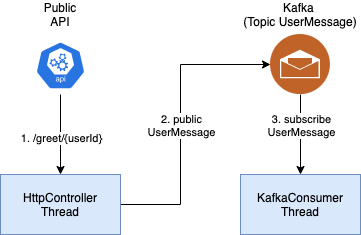

The example project for StringBoot service

<div align="center">
    
</div>

## Getting Started

## Project structure
```
.
├── spring-boot-kafka
│   ├── Dockerfile
│   ...
├── docker-compose.yaml
|
└── README.md
```

## Prerequisites
- Make sure that you have Docker and Docker Compose installed
  - Windows or macOS:
    [Install Docker Desktop](https://www.docker.com/get-started)
  - Linux: [Install Docker](https://www.docker.com/get-started) and then
    [Docker Compose](https://github.com/docker/compose)

## Start project
### Start project in local

- Install infrastructure

- Build project
```shell script
$ ./mvnw clean package
$ cd spring-boot-kafka
$ ../mvnw spring-boot:run
...
```

### Start project in docker 

- Start project
```shell script
$ docker-compose up -d
```

- Stop project
```shell script
$ docker-compose down
```

## Run test

```shell script
$ curl -H "Content-Type: application/json" --request POST --data '{"message":"xyz"}' http://localhost:8081/greet/1
```

Service log:
```text
2021-09-08 10:45:03.982  INFO 5697 --- [ntainer#0-0-C-1] i.c.s.e.kafka.ByeUserKafkaConsumer       : Consumed - Partition: 0 - Offset: 1 - Value: {"user_id":1,"message":"xyz"}
2021-09-08 10:45:03.982  INFO 5697 --- [ntainer#0-0-C-1] i.c.s.e.kafka.ByeUserKafkaConsumer       : Bye use 1 with message xyz

```

## Contribute

## Reference